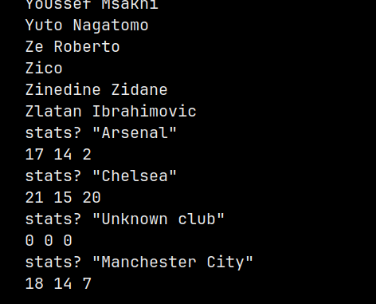
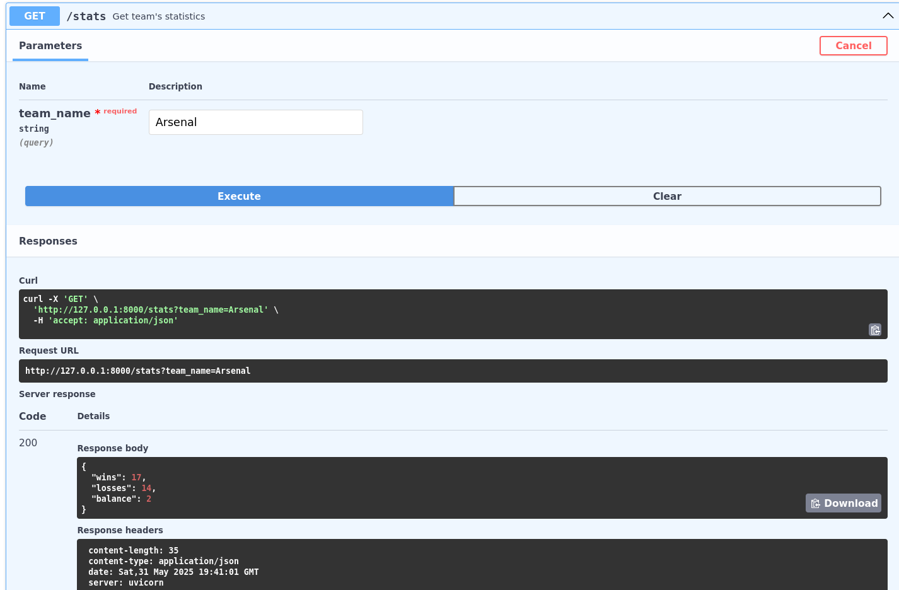
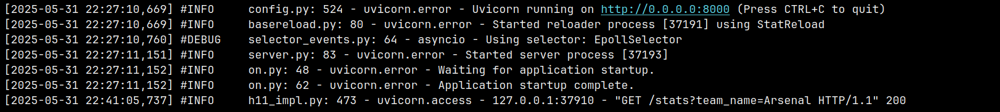

<div align="center">
    <a href="https://github.com/dmkjfs/lksh-enter-2025/blob/dev/LICENSE">
      
    </a>
    <a href="https://github.com/ilkztsff/lksh-enter-2025/blob/dev/pyproject.toml">
      
    </a>
    <a href="https://github.com/dmkjfs/lksh-enter-2025/actions/workflows/check.yml">
      
    </a>
</div>

<h1 align="center">lksh-enter-2025</h1>

## ℹ️ About

Test assignment for lksh-2025 P-parallel






## 🛠 Build commands

Required to have `make`, `uv`, `docker` and `docker-compose` installed.
All commands can be executed in bash. Don't forget to add required constants
into `.env` file before start. API documentation is available after
launch on http://127.0.0.1:8000/

Quick run(API in docker + CLI locally) for those who don't wanna read :)
```bash
make venv build up run-cli
```

Create/recreate virtual environment with dependencies
```bash
make venv
```

Lint + type check the project
```bash
make lint
```

Build API container 
```bash
make build
```

Run API
```bash
make start
```

Run API in background mode
```bash
make start
```

Run CLI
```bash
make run-cli
```
